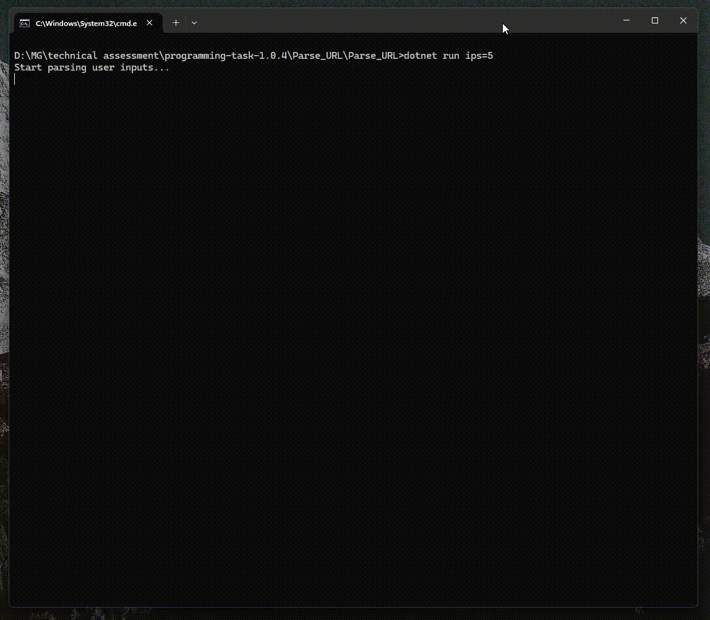

# Log Analyser - C# Console App :pager:

## Table of Contents
- [Overview](#overview)
- [Objectives](#objectives)
- [Techstack](#techstack)
- [Project Structure](#project-structure)
- [Assumptions](#assumptions)
- [Setup](#setup)
- [Features](#features)
- [Expected Output](#expected-output)
- [Demo](#demo)
- [Reference](#reference)

## Overview :page_with_curl:
This is a simple console application written in C# that reads a log file and generates useful statistics based on the data. 

Sample log file:
```
177.71.128.21 - admin [10/Jul/2018:22:21:28 +0200] "GET /intranet-analytics/ HTTP/1.1" 200 3574 "-" "Mozilla/5.0 ..."
79.125.00.21 - - [10/Jul/2018:20:03:40 +0200] "GET /newsletter/ HTTP/1.1" 200 3574 "-" "Mozilla/5.0 (compatible; MSIE 10.0; Windows NT 6.1; Trident/5.0)"
```
> You can read more about this log file structure in the [Reference](#reference) section.

## Objectives :dart:
The goal of this application is to answer three main questions: 
- What are the number of unique IP addresses?
- Which are the top 3 most visited URLs?
- Which are the top 3 most active IP addresses?

## Techstack :computer:
- **Language**: C#
- **.Net Version**: .Net 8.0 (*It should work on older .NET versions as well.*)
- **Libraries**: 
    - `System.IO` (for file reading)
    - `Console` (for console output)
    - `LINQ` (for data manipulation)
    - `System.Globalization` (for DateTime parsing)
    - `System.Text.RegularExpressions` (for Regex)

## Project Structure :open_file_folder:
The project structure is as follows:
```bash
.
│── Parse_URL
│   │── Configs
│   │── Data
│   │── Models
│   │── Services
│   └── Program.cs
│── Parse_URL.Tests
└── Parse_URL.sln
```

- `Parse_URL` folder: the main application code.
    - `Configs`: logics around loading configurations and reading user arguments.
	- `Data`: contains a sample log file `example.log`.
	- `Models`: the data models used in the application.
	- `Services`: logics to parse log entries and calculate statistics.
	- `Program.cs`: the entry point of the application.
- `Parse_URL.Tests` folder: tests for the application.
- `Parse_URL.sln`: the solution file for the project.

## Assumptions :children_crossing:
- Each log entry is on a new line.
- The log entries will follow the Common Log Format (CLF).
- The log file only contains 2xx success logs. 
- The IP addresses will always be IPv4 addresses and timestamp will always follow the same format as the `example.log`.  
- When returning the result, `http://example.net/faq/` and `/faq/` are considered as two different URLs.
- By default, the application will only display the number of items requested by the user. If there are any ties, they will be ignored. This behaviour can be changed by following the instructions [here](###include-ties-in-the-results).

## Setup :wrench:
### Prerequisites
- Install [.NET Core SDK](https://dotnet.microsoft.com/download) on your machine.

### Steps
1. Clone this repository. 
    ```bash
    git clone https://github.com/Jianyin-L/parse_url.git
    ```
2. Navigate to the project directory `Parse_URL`.
	```bash
    cd Parse_URL/Parse_URL
    ```
    From there, you should see a folder named `./Data` which contains a sample log file `example.log`.

3. Build and run the project by running the following commands:
    ```bash
    dotnet build
    dotnet run
    ```
    The results will be displayed in the console.  

4. To run the tests, from the root folder `Parse_URL`, navigate to the `Parse_URL.Tests` folder and run:
    ```bash
    cd ./Parse_URL.Tests
    dotnet test
    ```

## Features :sparkles: 

### Read a Different Log File
The application by default reads log file `./Data/example.log`.  
To change it, pass the file path as an argument when running the application:
```bash
dotnet run file=test1.log
```
This can be any log file as long as it follows the log structure mentioned in the [Reference](#reference) section.

### Customise the Number of Items to Return
The application is set to return the top 3 most visited URLs and the top 3 most active IP addresses.  
To return a different number of items:
```bash
dotnet run urls=5 ips=2
```
This will return the top 5 most visited URLs and the top 2 most active IP addresses.

### Include Ties in the Results
The application does not include ties when displaying the results by default.  
For example, it will only output the top 3 most active IPs even though the 4th IPs may have the same level of activeness as the 3rd.  
To include ties in the results:
```csharp
dotnet run includeTies=true
```
By setting `includeTies=true`, when the user requests the top 3 most active IPs, IPs with the same level of activeness as the 3rd one will still be included in the results, making it possible to have more than 3 IPs in the output.

### Filter Out Missing Required Fields
The application does not filter out entries if the entry is missing a required field.  
For example, if the log entry does not contain a URL, it will still be considered as a valid entry when calculating the most active URLs.  
To change this behaviour:

```csharp
dotnet run filterMissing=true
```
By setting `filterMissing=true`, if the user is requesting the most active URLs and a log entry does not contain a URL, then the application will not consider that entry valid and will filter it out in the result.  

### Mix and Match
You are more than welcome to combine these options when running the application. For example:
```bash
dotnet run file=test1.log urls=5 filterMissing=true
```

## Expected Output :chart_with_upwards_trend:
The expected output when running the application is as follows:
```
Results:
=========================================
Total Number of Entries:23

=========================================
Number of Unique IP Addresses:11

=========================================
Top 3 Most Visited URLs:
/docs/manage-websites/: 2 times
/intranet-analytics/: 1 times
http://example.net/faq/: 1 times

=========================================
Top 3 Most Active IPs:
168.41.191.40: 4 times
177.71.128.21: 3 times
50.112.00.11: 3 times
```
which means: 
- There are 23 entries in the log file `example.log`.
- There are 11 unique IP addresses.
- The top 3 most visited URLs are `/docs/manage-websites/`, `/intranet-analytics/`, and `http://example.net/faq/`.
- The top 3 most active IPs are `168.41.191.40`, `177.71.128.21`, and `50.112.00.11`.

## Demo :rocket:
### Run the application with default settings


### Run the application with custom settings


### Run tests


## Reference :books:
### Log structure
**Common Log Format (CLF)** and **Combined Log Format** are standard formats used by web servers like Apache and Nginx.  

Example log:  
```
177.71.128.21 - admin [10/Jul/2018:22:21:28 +0200] "GET /intranet-analytics/ HTTP/1.1" 200 3574 "-" "Mozilla/5.0 ..."
```

Each section represents a different piece of information:

**Field** | **Description**
--- | ---
177.71.128.21 | IP address of the client making the request
`-` | Remote log name (typically unused)
admin | User Name
[10/Jul/2018:22:21:28 +0200] | Timestamp of the request
"GET /intranet-analytics/ HTTP/1.1"	| HTTP request method, URL, and protocol
200	| HTTP status code
3574 | Response size in bytes (excluding headers)
`-`	| Referrer, which page a visitor was on before arrived at the site (if empty, "-")
"Mozilla/5.0 ..." | User-Agent (browser or tool making the request)

Reading more here: https://signoz.io/guides/apache-log/
